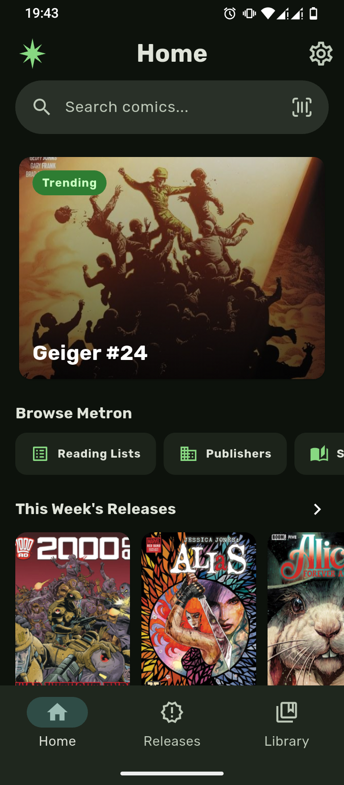
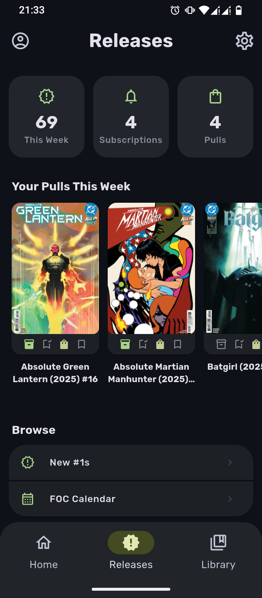
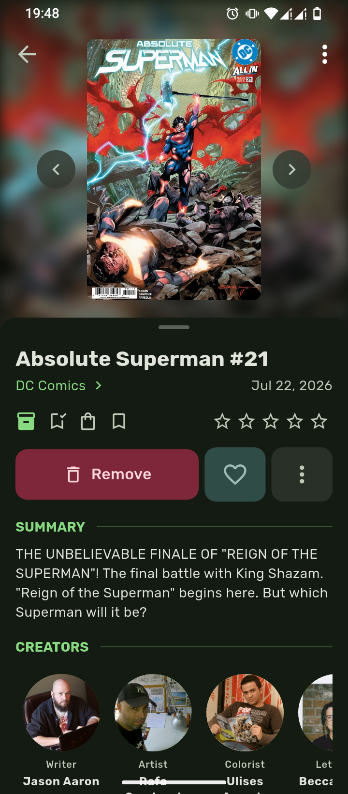
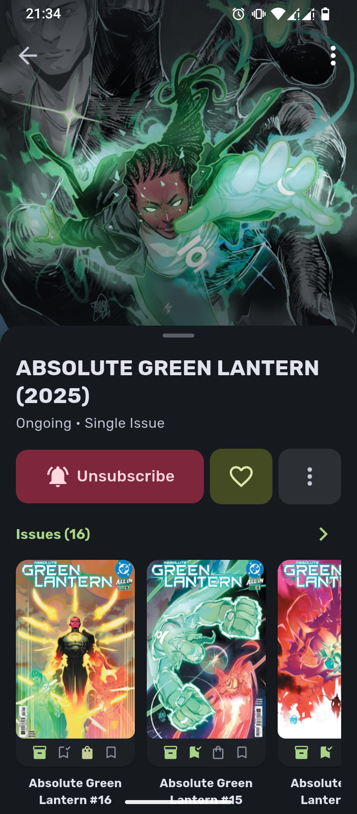

<p align="center">
  
</p>

<h1 align="center">Takion</h1>

<p align="center">
  <strong>Android app for Metron-powered comic pull-list and collection tracking.</strong><br>
  Built with Flutter and Riverpod
</p>

<p align="center">
  <table>
    <tr>
      <td align="center"></td>
      <td align="center"></td>
      <td align="center"></td>
      <td align="center"></td>
    </tr>
  </table>
</p>

<p align="center">
    <a href="https://github.com/allanabiud/takion/releases/latest">
        
    </a>
    
    
</p>

---

## ✨ Features

### 📋 Pull List Management

- **Weekly Releases**: Track upcoming issues and keep up to date with your favourite comic series.
- **Pull Reminders**: Receive weekly notifications about upcoming pull list issues.

### 📚 Library Tracking

- **Collection Management**: Track which comics are in your collection with ease.
- **Reading Lists**: Create custom reading lists, mark issues as read to track your history and export/import lists for sharing.
- **Collection Stats**: Visualize reading metrics and collection insights.

### 🔍 Discovery & Organization

- **Barcode Scanner**: Scan comic barcodes to quickly look up, add and collect issues.
- **Bulk Actions**: Apply pull list, collection, read status, wishlist and rating changes to multiple scanned issues at once.
- **Wishlist**: Keep an organized list of wanted issues.
- **Detailed Insights**: View collector-focused stats about your reading habits.

### 💾 Backup & Sync

- **Local Backups**: Create backups of your data for safekeeping.
- **Cloud Sync**: Seamlessly sync your pull list, library, reading logs, favorites and reading lists across devices via Google Drive.

---

## 🛠️ Tech Stack

| Category             | Technology                                              |
| -------------------- | ------------------------------------------------------- |
| **Language**         | [Dart](https://dart.dev/)                               |
| **Framework**        | [Flutter](https://flutter.dev/)                         |
| **State Management** | [Riverpod](https://riverpod.dev/)                       |
| **Networking**       | [Dio](https://pub.dev/packages/dio)                     |
| **Logging**          | [Talker](https://pub.dev/packages/talker)               |
| **Database**         | [Drift](https://pub.dev/packages/hive_ce)               |
| **Cloud Storage**    | [Google Drive API](https://pub.dev/packages/googleapis) |
| **Architecture**     | Domain-Driven-Design                                    |

---

## 🤝 Contributing

Contributions are welcome! Please feel free to submit a Pull Request.

1. Fork the Project
2. Create your Feature Branch (`git checkout -b feature/AmazingFeature`)
3. Commit your Changes (`git commit -m 'Add some AmazingFeature'`)
4. Push to the Branch (`git push origin feature/AmazingFeature`)
5. Open a Pull Request

### Prerequisites

- Flutter SDK 3.x
- Flutter-supported IDE
- Android SDK 29+

### Installation

1. **Clone the repository**

   ```sh
   git clone https://github.com/allanabiud/takion.git
   ```

2. **Setup Dependencies**

   ```sh
   flutter pub get
   ```

3. **Run the project**
   - Connect a device or start an emulator
   - Run via IDE or `flutter run`

---

## 📄 License

This project is licensed under the MIT License - see the [LICENSE](LICENSE) file for details.

---

<p align="center">
  Made with ❤️ by <a href="https://github.com/allanabiud">allanabiud</a>
</p>
