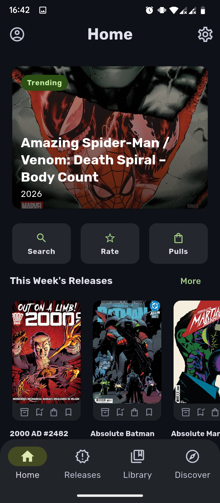
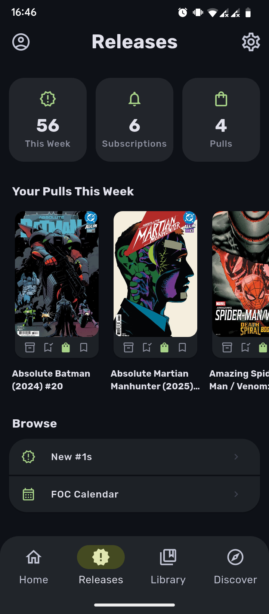
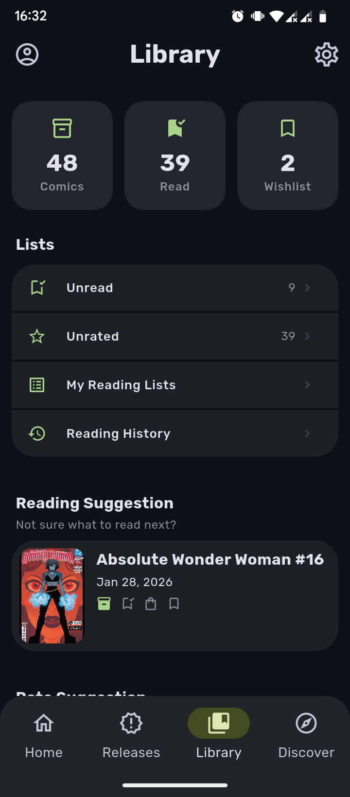
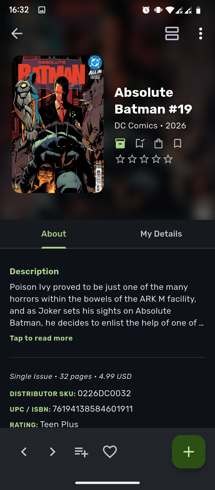

<p align="center">
  
</p>

<h1 align="center">Takion</h1>

<p align="center">
  <strong>Android app for Metron-powered comic pull-list and collection tracking.</strong><br>
  Built with Flutter and Riverpod
</p>

<p align="center">
  <table>
    <tr>
      <td align="center"></td>
      <td align="center"></td>
      <td align="center"></td>
      <td align="center"></td>
    </tr>
  </table>
</p>

<p align="center">
    <a href="https://github.com/allanabiud/takion/releases/latest">
        
    </a>
    
    
</p>

---

## ✨ Features

### 📋 Pull List Management

- **Weekly Activity**: Track upcoming issues and manage your weekly pull list efficiently.
- **Automated Sync**: Keep your list in sync with Metron-powered data.

### 📚 Library Tracking

- **Collection Management**: Organize your comic book collection with ease.
- **Reading Lists**: Create and manage custom reading lists for your favorite arcs, series, or themes.
- **Reading Progress**: Mark issues as read and keep track of your reading history.
- **Comprehensive Library Stats**: Gain deep insights into your collection with detailed visualizations and reading metrics.
- **Personal Ratings**: Rate your issues and see statistics of your collection.

### 🔍 Discovery & Organization

- **Wishlist Support**: Keep a separate, organized list of wanted issues.
- **Detailed Insights**: View collector-focused stats about your reading habits.

---

## 🛠️ Tech Stack

| Category             | Technology                            |
| -------------------- | ------------------------------------- |
| **Language**         | [Dart](https://dart.dev/)             |
| **Framework**        | [Flutter](https://flutter.dev/)       |
| **State Management** | [Riverpod](https://riverpod.dev/)     |
| **Networking**       | [Dio](https://pub.dev/packages/dio)   |
| **Database**         | [Hive](https://pub.dev/packages/hive) |
| **Architecture**     | Domain-Driven-Design                  |

---

## 🚀 Getting Started

### Prerequisites

- Flutter SDK 3.x
- Android Studio or VS Code with Flutter extensions
- Android SDK 29+

### Installation

1. **Clone the repository**

   ```sh
   git clone https://github.com/allanabiud/takion.git
   ```

2. **Setup Dependencies**

   ```sh
   flutter pub get
   ```

3. **Run the project**
   - Connect a device or start an emulator
   - Click Run

---

## 🤝 Contributing

Contributions are welcome! Please feel free to submit a Pull Request.

1. Fork the Project
2. Create your Feature Branch (`git checkout -b feature/AmazingFeature`)
3. Commit your Changes (`git commit -m 'Add some AmazingFeature'`)
4. Push to the Branch (`git push origin feature/AmazingFeature`)
5. Open a Pull Request

---

## 📄 License

This project is licensed under the MIT License - see the [LICENSE](LICENSE) file for details.

---

<p align="center">
  Made with ❤️ by <a href="https://github.com/allanabiud">allanabiud</a>
</p>
